# EasyLink

[](https://github.com/tuckercr/easylink/actions/workflows/ci.yml)

**An Android home-screen replacement for older adults, and the caregiver companion app
that sets it up and watches over it — connected through Firebase.**

The person gets a phone they can actually use: big buttons, high contrast, one-touch
help. Their family gets to configure that phone, and know they're okay, from their own.

> **Status:** in active development. The launcher is feature-complete and runs on
> device; **EasyLink Care** has pairing and remote emergency-contact management working
> end-to-end, with medication and alert syncing in progress. Not yet on Google Play.
> Marketing site: **[easylinkcare.com](https://easylinkcare.com)**.

| EasyLink Launcher — the elder's phone | EasyLink Care — the caregiver's phone |
|---|---|
| 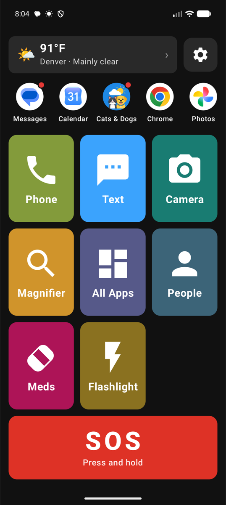 | 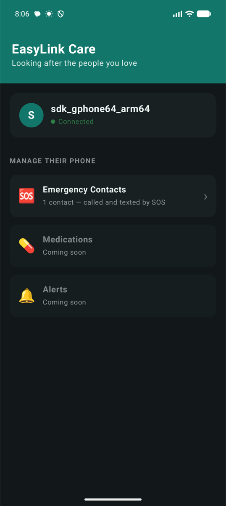 |

---

## Contents

- [Architecture](#architecture) · [Engineering highlights](#engineering-highlights)
- [Pairing & remote setup](#pairing--remote-setup)
- [Launcher features](#launcher-features) · [Care features](#care-features)
- [Tech stack](#tech-stack) · [Building & testing](#building--testing)
- [Firebase setup](#firebase-setup) · [Remote Config](#remote-config) · [Permissions](#permissions)

---

## Architecture

Four Gradle modules — two apps that must agree on a data contract, and two libraries.

| Module | Type | Package | What it is |
|---|---|---|---|
| `:app` | application | `com.fangjet.launcher` | **EasyLink Launcher** — the home screen replacement on the elder's phone. Free. |
| `:care` | application | `com.fangjet.care` | **EasyLink Care** — the caregiver companion app. The paid tier. |
| `:shared` | library | `com.fangjet.shared` | The Firestore contract both apps read and write: document paths, DTOs, pairing protocol, remote-config keys. |
| `:weather` | library | `com.fangjet.weather` | Self-contained weather widget (Open-Meteo + FusedLocation). Knows nothing about EasyLink — reusable in any app. |

Dependencies flow one way: `:app` → `:shared` + `:weather`; `:care` → `:shared`. The
libraries depend on nothing else in this repo.

```
   ┌──────────────────┐                      ┌──────────────────┐
   │  :app (launcher) │                      │  :care (family)  │
   │  elder's phone   │                      │ caregiver's phone│
   └────────┬─────────┘                      └────────┬─────────┘
            │            ┌──────────────┐             │
            └───────────►│   :shared    │◄────────────┘
                         │  contract    │
                         └──────┬───────┘
                                │
            ┌───────────────────▼───────────────────┐
            │  Firebase — Auth · Firestore · Config │
            │  links/{linkId}                       │
            │    ├─ config/current   Care  ──► phone│
            │    ├─ status/current   phone ──► Care │
            │    └─ events/{id}      phone ──► Care │
            └───────────────────────────────────────┘
```

---

## Engineering highlights

The parts worth reading the code for.

**`:shared` turns a sync bug into a build error.** Two apps coupled by a Firestore
schema will drift — one writes `timesOfDay` as ISO strings, the other still parses
minutes-since-midnight, and nothing catches it until two real devices disagree. The
DTOs live in one module both apps compile against, so the mismatch fails the build
instead of the user. See [`FirestorePaths`](shared/src/main/java/com/fangjet/shared/FirestorePaths.kt)
and [`model/`](shared/src/main/java/com/fangjet/shared/model).

**Pairing is a 6-digit code with the security in the rules, not the client.** The code
is the *document id* of a short-lived `pairingCodes/{code}` lookup doc — readable by
`get` but never `list`, so the code itself is the secret. Redemption is a rules-gated
write: a caregiver may add **only their own uid** to `caregiverUids`, only while a live
unexpired code is set, and can never remove anyone else. See
[`firestore.rules`](firestore.rules) and [`PairingCode`](shared/src/main/java/com/fangjet/shared/PairingCode.kt).

**Config sync applies each revision exactly once.** The caregiver's config is
authoritative, but replaying an old revision after a process restart would clobber
newer local state — so [`ConfigSyncManager`](app/src/main/java/com/fangjet/launcher/data/pairing/ConfigSyncManager.kt)
tracks the last applied `updatedAt` in DataStore and ignores anything older.

**Write direction is enforced server-side.** `config` is caregiver-owned, `status` and
`events` are device-owned, and events are append-only — the elder's phone can never
rewrite its own configuration, and nobody can quietly delete an alert.

**Safety behaviour is server-tunable, and validated before use.** SOS hold duration,
countdown length, and feature defaults come from Firebase Remote Config, but every
value is range-checked and clamped in-app — a fat-fingered console entry falls back to
the compiled-in default instead of making SOS impossible to trigger. See
[`SettingsDefaults`](shared/src/main/java/com/fangjet/shared/config/SettingsDefaults.kt).

**"Most used apps" without a special permission.** Android's `UsageStatsManager` needs
the *Usage access* grant — a Settings journey this audience will not complete. Because
EasyLink *is* the home screen, every launch already flows through one use case, so
ranking comes from local counts instead. Before any history exists, a curated priority
list fills the row rather than the alphabet. See
[`FavoriteAppsSelector`](app/src/main/java/com/fangjet/launcher/domain/FavoriteAppsSelector.kt).

**Permission denial is a designed state, not a crash.** SOS falls back from `ACTION_CALL`
to `ACTION_DIAL`, reports partial success honestly (SMS sent but call blocked), and the
setup flow asks for what it needs up front. See
[`SosRepositoryImpl`](app/src/main/java/com/fangjet/launcher/data/repository/SosRepositoryImpl.kt).

---

## Pairing & remote setup

The feature that makes the two apps one product. Setup takes about a minute and only
one person needs to be comfortable with a phone.

1. On the elder's phone: **Settings → Connect Family** shows a large 6-digit code.
2. The family member types it into EasyLink Care.
3. Both screens flip to **Connected** in real time (Firestore snapshot listeners).
4. The caregiver can now edit the elder's emergency contacts from their own phone —
   changes land on the elder's device within seconds and become the numbers SOS calls
   and texts.

| Launcher shows the code | Care manages contacts remotely | …and they appear on the phone |
|---|---|---|
| 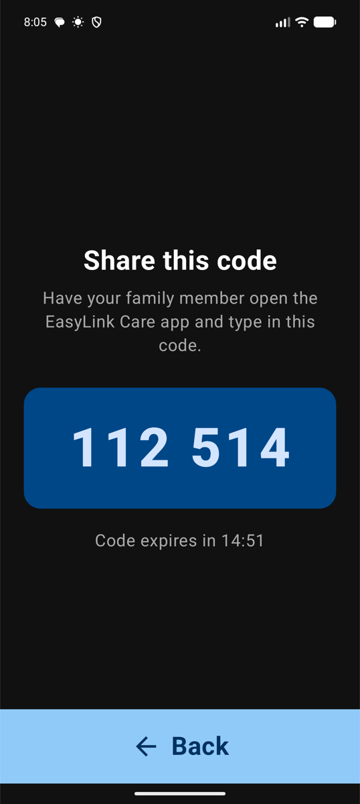 | 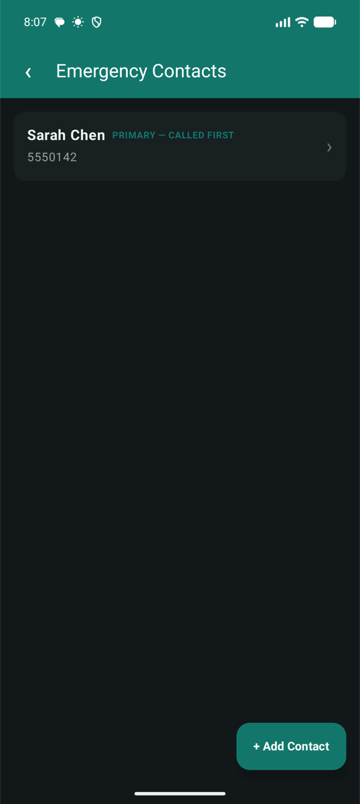 | 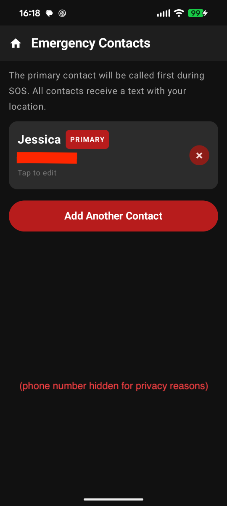 |

Codes expire after 15 minutes and are single-use — redemption clears them.

---

## Launcher features

### Home screen
Large, colour-coded quick-action buttons in a grid that scales to fill the screen; each
can be shown or hidden in Settings. Long-pressing a button reads its label aloud.

| Button | What it does | Default |
|---|---|---|
| **Phone** | Opens the system dialer | Enabled |
| **Text** | Opens the default messaging app | Enabled |
| **Camera** | Launches the system camera | Enabled |
| **Magnifier** | Built-in magnifier (camera zoom) | Enabled |
| **All Apps** | Every installed app (also: swipe up) | Enabled |
| **People** | Photo speed dial for favourites | Enabled |
| **Meds** | Medication schedule | Enabled |
| **Flashlight** | Toggles the rear torch | Enabled |
| **Web · Maps · Email · Photos · YouTube · Calculator** | Launch the matching app | Optional |

Navigation is deliberately flat: the grid, a swipe up for all apps, and a settings gear
beside the weather card. Every sub-screen has a full-width **Back** bar rather than a
small system chevron.

### My Apps row
A horizontally scrollable row of the user's **real apps with their real icons** —
Spotify, Audible, WhatsApp — directly on the home screen.

- Ranked by the apps they actually open (no special permissions — see highlights above).
- Or hand-picked: **Settings → My Apps Row → Choose My Apps**.
- **Notification dots** — a Pixel-style red dot when an app has something waiting.
  Ongoing notifications (music playback) and group summaries are excluded. Requires the
  user to grant notification access; off by default, and the toggle deep-links to the
  system settings page.
- Row length is Remote Config-tunable (default 12).

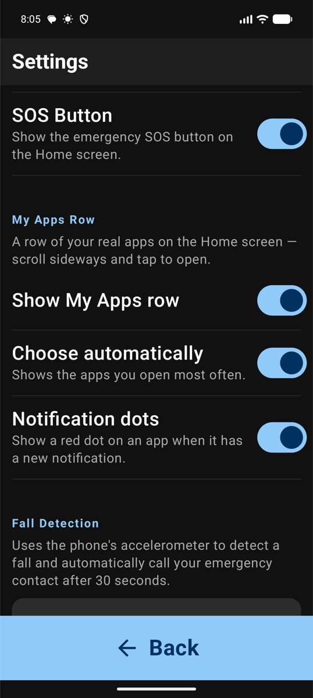

### SOS
The red **SOS** button must be held for 3 seconds — a white sweep fills the button as it
is held, so a stray touch in a pocket can't trigger it. Completing the hold opens a
countdown screen with a large **Cancel**. If it isn't cancelled, EasyLink:

- calls the primary emergency contact,
- sends an SMS alert to every emergency contact,
- includes GPS coordinates in that SMS when location permission is granted.

If a permission is missing it degrades honestly — falling back to the dialer, and
reporting exactly what did and didn't happen. Hold duration and countdown length are
both Remote Config-tunable.

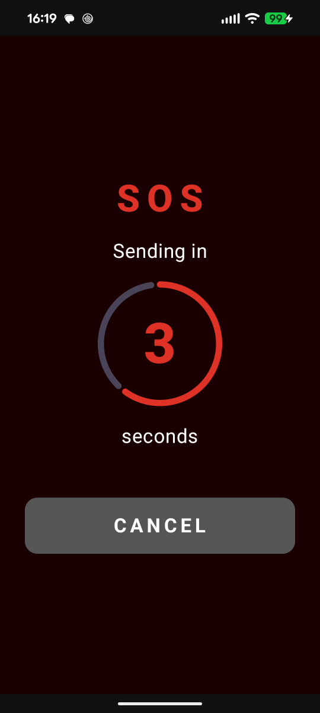

### Fall detection
An opt-in foreground service watches the accelerometer for a sharp impact followed by
inactivity, then shows a full-screen alert with a 30-second countdown and an **"I'm OK"**
button. If the countdown ends, it calls the primary emergency contact. Sensitivity is
adjustable (Low / Medium / High).

### People (speed dial)
Favourite contacts as large photo cards — tap to call. Phone numbers are hidden to keep
the screen calm; long-press opens an edit sheet with delete inside it. Photos can be
picked from the gallery and are copied into app storage so they survive.

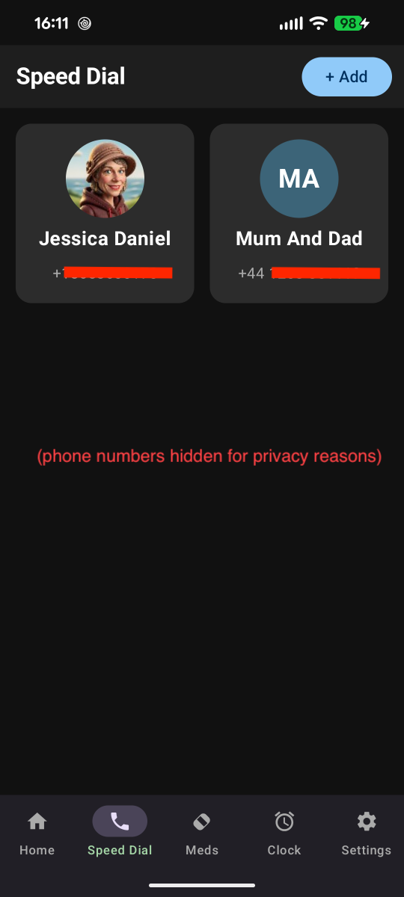

### Medication reminders
Medications with one or more daily reminder times. Notifications carry **Take** and
**Snooze** actions, and alarms survive reboot.

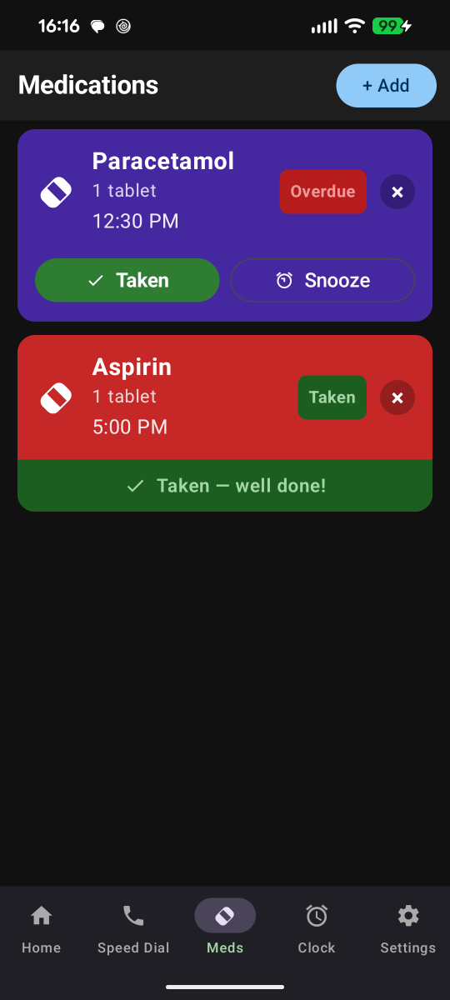

### Weather
A card at the top of the home screen — current temperature, conditions, and city from
[Open-Meteo](https://open-meteo.com/); tap for a 7-day forecast. Location and the last
reading are cached, so it stays useful offline. Location is resolved on-device and never
shared. Lives in the reusable `:weather` module.

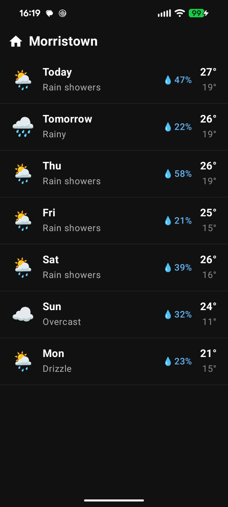

### Voice commands
An optional **"Say a Command"** bar. The microphone is only live while the overlay is
visible.

| Say | Result |
|---|---|
| "Call John" | Looks up John in contacts and dials |
| "Text Mary" | Opens the SMS composer to Mary |
| "Open Camera" / "Take a photo" | Launches the camera |
| "Open YouTube" | Launches any installed app by name |
| "Flashlight on" / "off" | Sets the torch |
| "Go home" | Returns to the home screen |

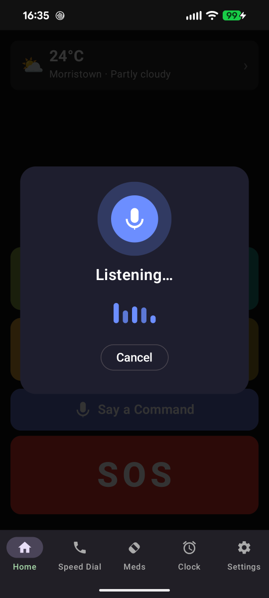

### Magnifier
Full-screen camera preview with pinch-to-zoom for reading small print, with a big back
bar and no top chrome.

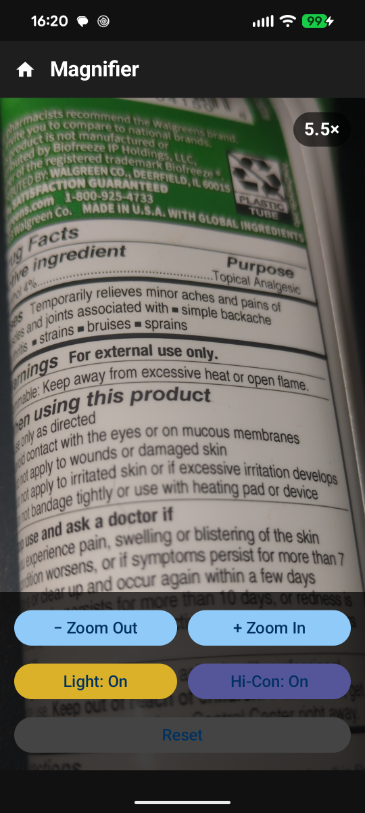

### Settings
One screen, oversized type and switches: show/hide each home button, the My Apps row and
its dots, voice and SOS buttons, high-contrast mode, fall detection and sensitivity,
emergency contacts, and **Connect Family**.

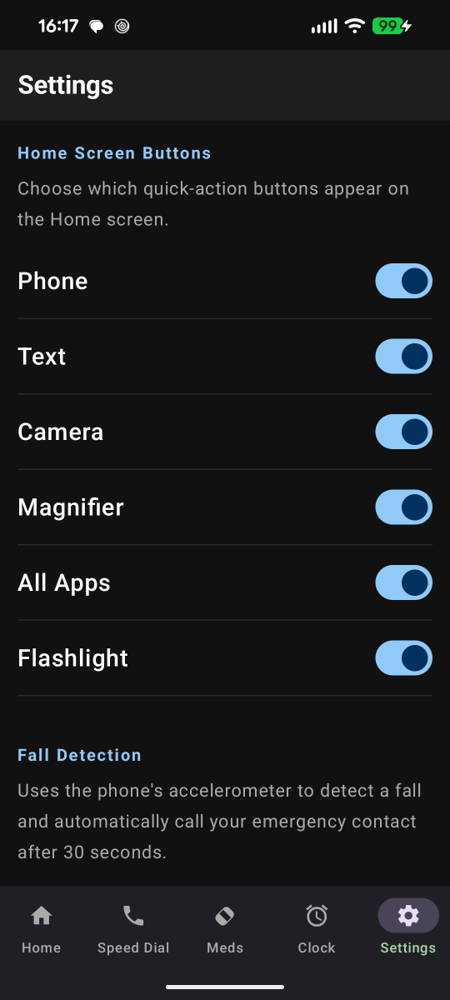

---

## Care features

The caregiver's app. Working today:

- **Pair with an elder's phone** using the 6-digit code.
- **Dashboard** — who you're looking after, and their connection state.
- **Emergency contacts** — add, edit, reorder and delete the contacts SOS uses, from
  anywhere. Writes are validated and land on the phone in seconds.

In progress: medication schedules, a status heartbeat (battery, last seen, adherence),
and an alerts feed with push notifications for SOS, falls and missed doses.

---

## Tech stack

- **UI:** Jetpack Compose + Material 3
- **Architecture:** MVVM + Clean Architecture, multi-module
- **DI:** Hilt
- **Concurrency:** Kotlin Coroutines & Flow
- **Persistence:** Room (database) + DataStore (preferences)
- **Cloud:** Firebase Auth · Cloud Firestore · Remote Config · Hosting (Cloud Functions and FCM next)
- **Background:** `AlarmManager` (reminders), foreground `Service` (fall detection), `NotificationListenerService` (badges)
- **Hardware:** CameraX, `CameraManager` (torch), `FusedLocationProviderClient`
- **Quality:** 260+ unit tests, ktlint, GitHub Actions CI

---

## Building & testing

```bash
./gradlew testDebugUnitTest              # all modules
./gradlew ktlintCheck                    # lint
./gradlew :app:assembleStandardDebug     # launcher APK (Play Store flavor)
./gradlew :app:assembleSafetyDebug       # launcher APK (full feature set)
./gradlew :care:assembleDebug            # companion APK
```

### Launcher flavors

The launcher builds in two distribution flavors (`app/build.gradle.kts`):

| | `standard` | `safety` |
|---|---|---|
| SOS button, fall detection, voice commands | — | ✅ |
| `SEND_SMS`, `ACCESS_FINE_LOCATION`, `RECORD_AUDIO`, health foreground service | not in manifest | requested |
| Distribution | Play Store | sideload (pending Play declarations) |

`standard` exists because Google Play restricts SMS and scrutinizes health-service
permissions; shipping the launcher first without them keeps review simple. The split is
enforced at three levels: a flavor manifest (`app/src/safety/AndroidManifest.xml`), a
compile-time `BuildConfig.SAFETY_FEATURES` flag gating every UI entry point, and an
injected [`FeatureFlags`](app/src/main/java/com/fangjet/launcher/data/config/FeatureFlags.kt)
that forces the SOS/voice preferences off so not even Remote Config or a caregiver
can surface a feature whose permissions aren't in the manifest.

Firebase is optional for building. Without `google-services.json` the apps compile and
run — Remote Config falls back to compiled-in defaults, and cloud features stay inert
rather than crashing.

---

## Firebase setup

The apps are wired to a Firebase project (Auth, Firestore, Remote Config, Hosting). To
build against your own:

1. Create a project at [console.firebase.google.com](https://console.firebase.google.com).
2. Register **four** Android apps under it — `com.fangjet.launcher`,
   `com.fangjet.care`, and the `.debug` variant of each. The debug builds use an
   `applicationIdSuffix`, and the `google-services` plugin matches package names exactly.
3. Download the merged `google-services.json` and copy it to **both** `app/` and `care/`.
   (It is git-ignored — each developer supplies their own.)
4. Enable **Authentication** (Anonymous for the launcher, Email/Password + Google for
   Care) and **Firestore**.
5. Deploy the rules and config from this repo:
   ```bash
   firebase deploy --only firestore:rules,remoteconfig
   ```
6. Cloud Functions require the **Blaze** plan — set a budget alert first. Develop
   against `firebase emulators:start` rather than production.

Document layout and the write direction of each subcollection are defined in
[`FirestorePaths`](shared/src/main/java/com/fangjet/shared/FirestorePaths.kt); the rules
that enforce them are in [`firestore.rules`](firestore.rules).

---

## Remote Config

Server-tunable **default** values, so out-of-the-box behaviour can change without
shipping an app update. Values sit in a precedence chain, each layer overriding the one
above it only when someone actually makes a choice:

```
SettingsDefaults.HARDCODED      compiled-in fallback, always works offline
  → Remote Config               global defaults set in the Firebase console
    → ElderConfig (Firestore)   a caregiver's per-elder choices
      → local user changes      the user's own toggles
```

| Key | Controls | Default | Clamp |
|---|---|---|---|
| `sos_hold_duration_ms` | How long SOS must be held | 3000 | 1000–10000 |
| `sos_countdown_seconds` | Cancel window before dispatch | 5 | 3–30 |
| `favorite_apps_max_count` | Apps in the My Apps row | 12 | 4–24 |
| `sos_button_visible_by_default` | SOS button on a fresh install | true | — |
| `voice_button_visible_by_default` | Voice bar on a fresh install | false | — |
| `high_contrast_by_default` | Start in high contrast | false | — |
| `fall_detection_enabled_by_default` | Fall detection on by default | false | — |
| `fall_sensitivity_default` | LOW / MEDIUM / HIGH | MEDIUM | validated |

- Keys and mapping: [`RemoteConfigKeys`](shared/src/main/java/com/fangjet/shared/config/RemoteConfigKeys.kt) · [`SettingsDefaults`](shared/src/main/java/com/fangjet/shared/config/SettingsDefaults.kt) (dependency-free, unit-tested)
- Firebase glue: [`RemoteConfigSettingsDefaultsProvider`](app/src/main/java/com/fangjet/launcher/data/config/RemoteConfigSettingsDefaultsProvider.kt) — self-guarding; returns hardcoded defaults when Firebase is absent
- Console parameters: [`firebase/remoteconfig.template.json`](firebase/remoteconfig.template.json)

Changing a default never overrides a choice a user or caregiver already made.

---

## Permissions

| Permission | Why it's needed | Flavor |
|---|---|---|
| `CAMERA` | Magnifier and flashlight | both |
| `ACCESS_COARSE_LOCATION` | Weather widget | both |
| `CALL_PHONE` | Speed dial and SOS calls | both |
| `READ_CONTACTS` | Speed dial and voice lookups | both |
| `POST_NOTIFICATIONS` | Medication reminders, fall alerts, set-as-home reminder | both |
| `RECEIVE_BOOT_COMPLETED` | Restore alarms and services after reboot | both |
| `INTERNET` | Weather, Firebase sync | both |
| `SEND_SMS` | SOS alert messages | safety |
| `ACCESS_FINE_LOCATION` | GPS coordinates in the SOS SMS | safety |
| `RECORD_AUDIO` | Voice commands | safety |
| `FOREGROUND_SERVICE_HEALTH` | Fall detection service | safety |
| `HIGH_SAMPLING_RATE_SENSORS` | Accelerometer for fall detection | safety |
| `USE_FULL_SCREEN_INTENT` | Fall alert over the lock screen (Android 14+) | safety |

Notification access (for the My Apps dots) is a separate user-granted setting, not a
manifest permission — the feature simply stays off until it's granted.

---

Built by [Colin Tucker](https://github.com/tuckercr) · [fangjet.com](https://www.fangjet.com)
