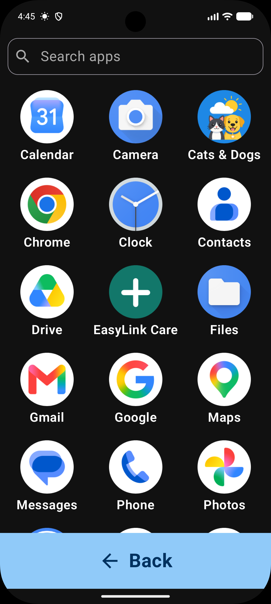
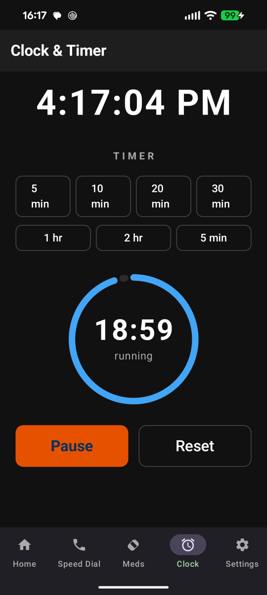

# EasyView Launcher

    A full-featured Android home screen replacement designed for elderly users. Large buttons, high contrast, and safety-first features.

---

## Features

### Home Screen
The home screen shows up to 12 large, color-coded quick-action buttons in a dynamic grid that scales to fill the screen. Each button can be individually shown or hidden from the **Settings** tab.

| Button | What it does | Default |
|---|---|---|
| **Phone** | Opens the system dialer | Enabled |
| **Text** | Opens the default messaging app | Enabled |
| **Camera** | Launches the system camera | Enabled |
| **Magnifier** | Opens the built-in magnifier (camera zoom) | Enabled |
| **All Apps** | Shows every installed app | Enabled |
| **Flashlight** | Toggles the rear torch on/off | Enabled |
| **Web** | Launches the web browser | Optional |
| **Maps** | Opens maps for navigation | Optional |
| **Email** | Opens the default email app | Optional |
| **Photos** | Opens the photo gallery | Optional |
| **YouTube** | Launches the YouTube app | Optional |
| **Calculator** | Opens the system calculator | Optional |

Long-pressing any button reads its label aloud via text-to-speech.

---

### Weather
A **weather card** at the top of the home screen shows the current temperature, conditions, and city name using the [Open-Meteo](https://open-meteo.com/) API. 
- **Offline Reliability:** Weather data and location are cached locally. If the network or GPS is unavailable, the app displays the "Saved location" and the time of the last update.
- **Forecast:** Tapping the card opens a **7-day forecast screen**.
- **Location Privacy:** Location permission is requested on first use; location is resolved on-device and never shared with third parties.

---

### Voice Commands
Enable the optional **"Say a Command"** button in Settings to speak naturally. The microphone is only active while the command overlay is visible.

| Say | Result |
|---|---|
| "Call John" | Looks up John in contacts and dials |
| "Text Mary" | Opens SMS composer to Mary |
| "Open Camera" / "Take a photo" | Launches the camera |
| "Open YouTube" | Finds and launches YouTube (or any installed app by name) |
| "All apps" | Navigates to the full app list |
| "Flashlight on" / "Flashlight off" | Sets the torch to the requested state |
| "Flashlight" | Toggles the torch |
| "Go home" | Returns to the home screen |

---

### SOS
The red SOS button starts a **10-second countdown**. If not cancelled:
- Automatically calls the primary emergency contact.
- Sends an SMS alert to all configured emergency contacts.
- Includes current GPS coordinates in the SMS (if permission is granted).

Emergency contacts are managed directly in **Settings → Emergency Contacts**.

---

### Fall Detection
When enabled in Settings, a foreground service monitors the accelerometer for sudden impacts followed by a period of inactivity.
1. A full-screen alert appears with a **30-second countdown**.
2. Tapping **"I'm OK"** dismisses the alert.
3. If the countdown reaches zero, the app automatically calls the primary emergency contact.

Sensitivity is adjustable: **Low** (fewer false alerts), **Medium** (recommended), or **High** (most sensitive).

---

### Speed Dial
The **Call** tab shows saved favorites as large tap-to-call cards. Contacts are added from the device address book.

---

### Medication Reminders
Add medications with one or more daily reminder times. Notifications include **Take** and **Snooze** actions. Alarms are persistent across device reboots.

---

### Magnifier & Clock
- **Magnifier:** Full-screen camera preview with pinch-to-zoom for reading small print.
- **Clock:** A large, high-contrast clock and timer display.

---

### Settings
The dedicated **Settings** tab allows users or caregivers to:
- Show/hide any of the 12 home screen quick-action buttons.
- Toggle the **Voice Command** and **SOS** buttons.
- Turn on **High-Contrast Mode** (brighter button colors and a pure-black background for easier reading).
- Manage **Emergency Contacts** (Add/Edit/Delete).
- Enable Fall Detection and adjust sensitivity.

---

## Navigation

The bottom navigation bar provides instant access to five areas:

| Tab | Description |
|---|---|
| **Home** | Primary actions, weather, and SOS |
| **Call** | One-tap speed dial for favorites |
| **Meds** | Medication reminder schedule |
| **Clock** | Large clock and timer |
| **Settings** | Configuration and emergency contacts |

---

## Permissions

| Permission | Why it's needed |
|---|---|
| `CAMERA` | Magnifier and flashlight |
| `RECORD_AUDIO` | Voice commands |
| `ACCESS_FINE_LOCATION` | GPS coordinates in SOS SMS |
| `ACCESS_COARSE_LOCATION` | Weather widget |
| `CALL_PHONE` | SOS and "Call" commands |
| `SEND_SMS` | SOS alert messages |
| `READ_CONTACTS` | Speed Dial and Voice command lookups |
| `POST_NOTIFICATIONS` | Medication reminders, fall alerts, and the daily set-as-home reminder |
| `FOREGROUND_SERVICE_HEALTH` | Fall detection background service |
| `HIGH_SAMPLING_RATE_SENSORS` | Accelerometer access for fall detection |
| `RECEIVE_BOOT_COMPLETED` | Restore alarms and service after reboot |
| `USE_FULL_SCREEN_INTENT` | Show Fall Alert on top of lock screen (Android 14+) |

---

## Tech Stack

- **UI:** Jetpack Compose + Material 3
- **Architecture:** MVVM + Clean Architecture
- **Concurrency:** Kotlin Coroutines & Flow
- **Persistence:** Room (DB) + DataStore (Preferences)
- **Background:** `AlarmManager` (Reminders), Foreground `Service` (Fall Detection)
- **Caching:** Jetpack Startup (App list pre-warming), Weather/Location persistence
- **Hardware:** `CameraManager` (Torch), `FusedLocationProviderClient` (GPS)
